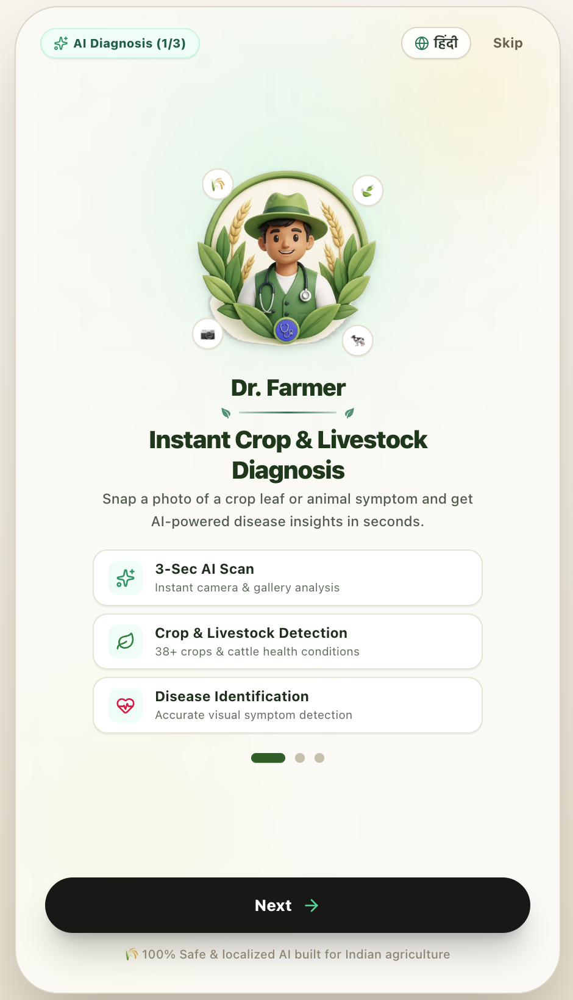
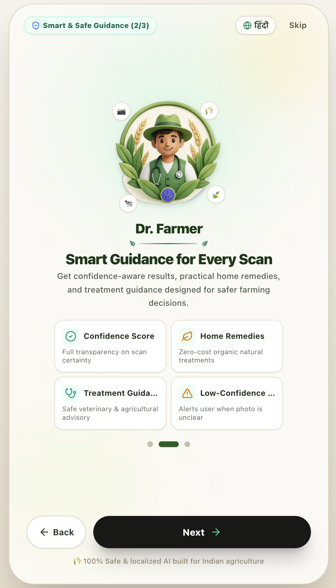
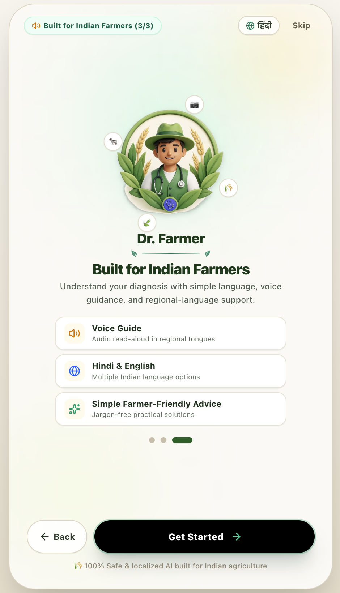
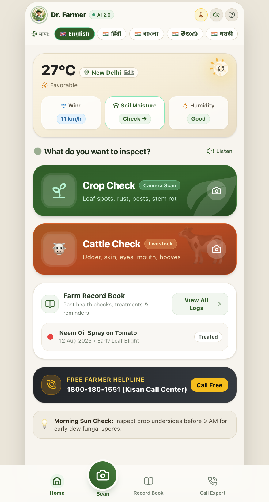
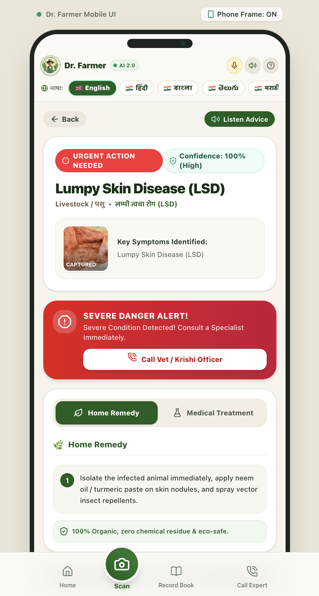
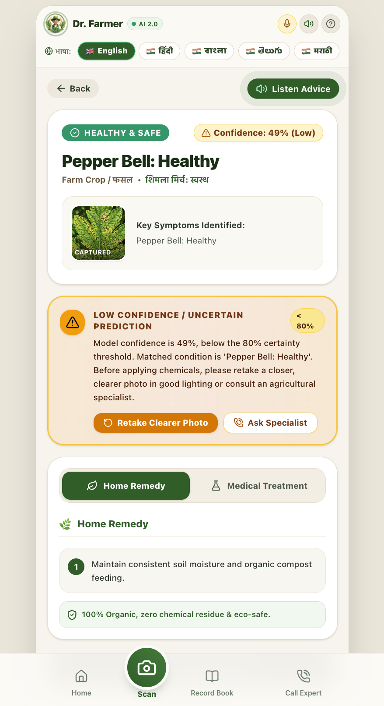
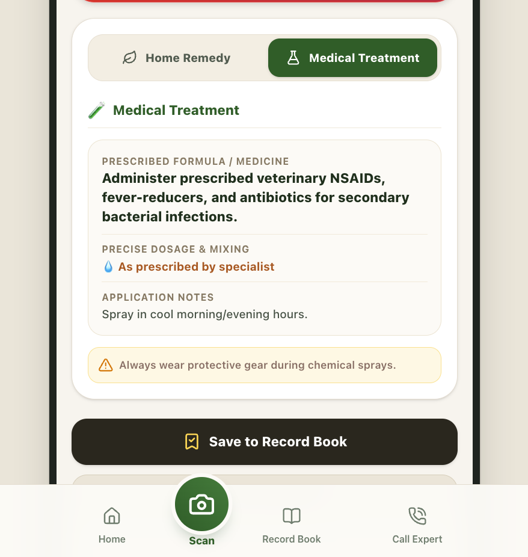
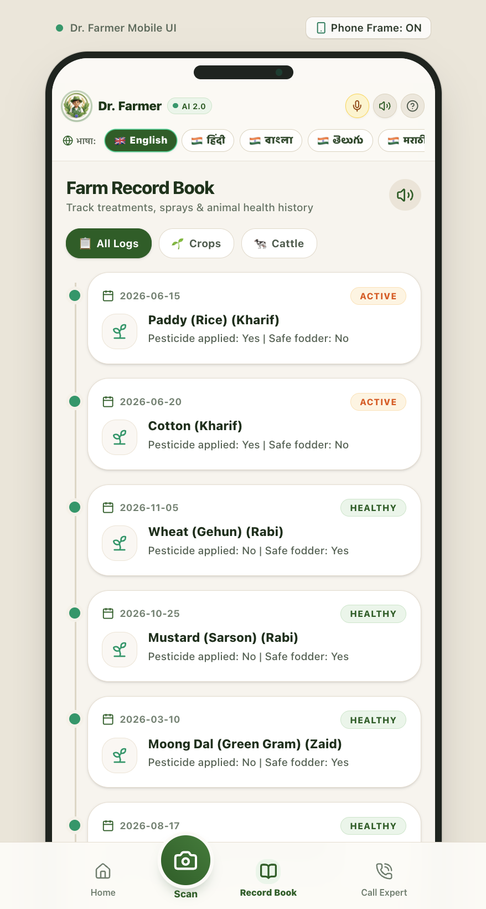
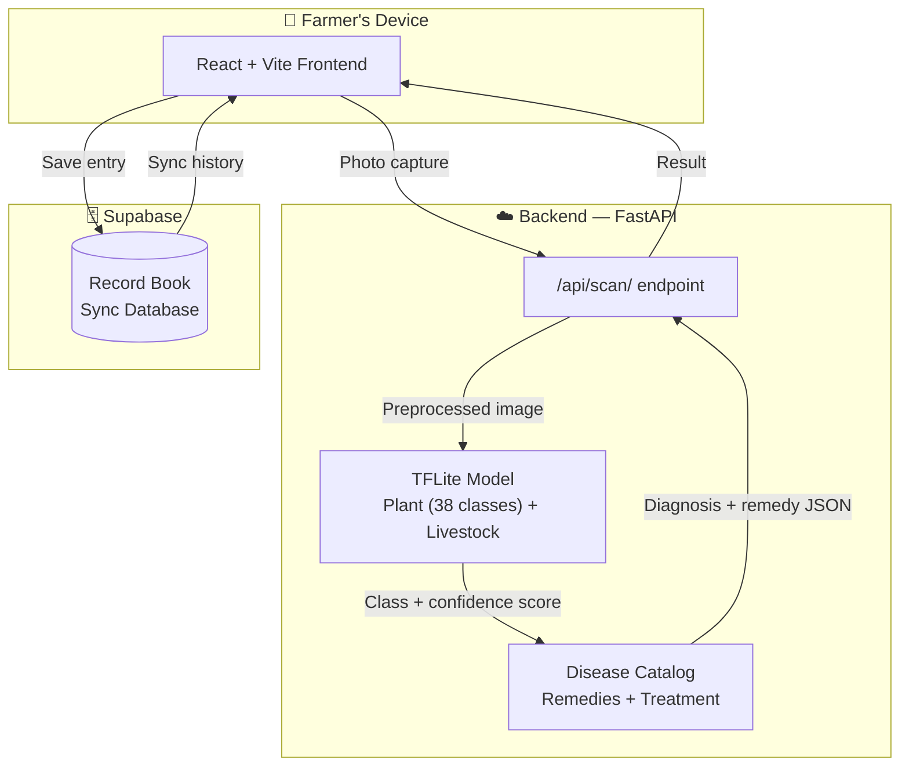
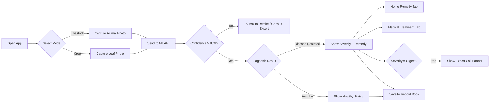

<div align="center">



# 🌱 Dr. Farmer

### AI-Powered Crop & Livestock Disease Advisory Platform

**Instant, farmer-friendly disease diagnosis for Indian agriculture — from photo to prescription in under 3 seconds.**

Built for **Smart India Hackathon (SIH)** &nbsp;·&nbsp; *Team Alpha Beta*

[](https://dr-farmer-agri-vision.vercel.app/)
[](https://react.dev)
[](https://fastapi.tiangolo.com)
[](https://www.tensorflow.org/lite)

**[🚀 Try the Live App →](https://dr-farmer-agri-vision.vercel.app/)**

</div>

---

## 📖 About The Project

**Dr. Farmer** is a mobile-first, AI-powered web application that helps low-literacy Indian farmers instantly diagnose crop and livestock diseases using nothing but their smartphone camera. Snap a photo, and within seconds get a diagnosis, a confidence score, and both **organic home remedies** and **medical treatment** — narrated aloud, in Hindi or English.

Built to bridge the gap between advanced agricultural science and farmers who may not be able to read complex text, every design decision — from oversized buttons to voice narration to confidence-aware warnings — puts accessibility first.

---

## ✨ Features

### 🧠 AI Diagnosis
- 🤖 **Real ML-based disease detection** — custom-trained TensorFlow Lite models, not a lookup table
- 🌾 **38+ crop disease classes** — apple, corn, grape, orange, peach, pepper, potato, tomato, raspberry, and more
- 🐄 **Livestock health detection** — trained specifically to catch Lumpy Skin Disease (LSD) in cattle
- 🎯 **Confidence-aware results** — a smart 80% certainty threshold flags uncertain scans instead of guessing, and prompts the farmer to retake the photo or consult a specialist

### 📱 Farmer-First Experience
- 📷 **One-tap camera scanning** — point, capture, diagnose
- 🌿 **Dual advisory system** — organic home remedies *and* precise medical/veterinary treatment, side by side
- 🚨 **Color-coded severity** — instant visual triage: Healthy (green) → Caution (yellow) → Urgent (red)
- 📞 **One-tap expert escalation** — urgent cases surface a direct "Call Vet / Krishi Officer" action
- 🔊 **Voice narration** — every diagnosis and remedy is read aloud for low-literacy users
- 🌐 **Hindi & English interface**, with 8 Indian languages supported at the data layer
- 📖 **Digital Farm Record Book** — a running timeline of crop cycles, treatments, and health history

### ☁️ Under the Hood
- 🌦️ **Live weather integration** — real-time conditions feed into farming recommendations
- 🗄️ **Cloud sync via Supabase** — records persist across sessions and devices
- ⚡ **TensorFlow Lite inference** — lightweight, optimized models built for fast, low-resource inference

---

## 📸 App Walkthrough

<table>
<tr>
<td width="33%" align="center">
<br/>
<b>Onboarding — AI Diagnosis</b>
</td>
<td width="33%" align="center">
<br/>
<b>Onboarding — Smart Guidance</b>
</td>
<td width="33%" align="center">
<br/>
<b>Onboarding — Built for Farmers</b>
</td>
</tr>
<tr>
<td width="33%" align="center">
<br/>
<b>Home — Weather + Quick Actions</b>
</td>
<td width="33%" align="center">
<br/>
<b>Urgent Result — LSD Detected</b>
</td>
<td width="33%" align="center">
<br/>
<b>Low-Confidence Safety Warning</b>
</td>
</tr>
<tr>
<td width="33%" align="center">
<br/>
<b>Medical Treatment Tab</b>
</td>
<td width="33%" align="center">
<br/>
<b>Farm Record Book</b>
</td>
<td width="33%" align="center">
<a href="https://dr-farmer-agri-vision.vercel.app/"><b>👉 See it live<br/>on your own device</b></a>
</td>
</tr>
</table>

---

## 🛠️ Tech Stack

<table>
<tr>
<td valign="top" width="50%">

**Frontend**
- React 19 + Vite
- Tailwind CSS v4
- Lucide React (icons)
- Canvas Confetti (celebratory UX)
- Web Speech API (voice narration)
- Deployed on **Vercel**

</td>
<td valign="top" width="50%">

**Backend / AI**
- FastAPI + Uvicorn (ASGI)
- TensorFlow Lite / AI Edge LiteRT
- Pillow + NumPy (image preprocessing)
- SpeechRecognition (voice input)
- Supabase (PostgreSQL + storage)
- Deployed on **Render**

</td>
</tr>
</table>

---

## 🏗️ System Architecture



## 🔄 User Flow



---

## 🚀 Run Locally

```bash
git clone https://github.com/nilkumarbhadani/Dr-Farmer-AgriVision.git
cd Dr-Farmer-AgriVision
```

**1. Backend**
```bash
cd backend
pip install -r requirements.txt
uvicorn main:app --reload --port 8000
```

**2. Frontend**
```bash
cd frontend
npm install
npm run dev
```

---

## 🔌 API Reference

**`POST /api/scan/`** — `multipart/form-data`

| Parameter     | Type   | Description                                |
| :------------ | :----- | :------------------------------------------ |
| `file`        | File   | **Required.** Image (.jpg / .png) to scan   |
| `entity_type` | String | **Required.** `"plant"` or `"animal"`       |
| `entity_id`   | String | **Required.** Identifier for the farm/entry |

**Response**
```json
{
  "scan_id": "string",
  "entity_type": "string",
  "pathology_detected": "string",
  "confidence_score": 0.94,
  "medical_remedy": "string",
  "home_remedy": "string"
}
```

---

## 🗺️ Roadmap

- [x] Crop & livestock disease detection UI
- [x] Hindi/English voice-guided interface
- [x] Real-time TFLite ML model integration (38-class plant, 2-class livestock)
- [x] Confidence-aware low-certainty warnings
- [x] Live weather integration
- [x] 8 Indian languages (text support)
- [x] Cloud deployment (Vercel + Render)
- [ ] Offline-first support (on-device inference without internet)
- [ ] Extension worker / FPO dashboard view
- [ ] Expanded voice support across all 8 languages

---

## 👥 Team Alpha Beta

| Name | Role | GitHub |
|------|------|--------|
| Nil Kumar Bhadani | Frontend / UI-UX Development | [@nilkumarbhadani](https://github.com/nilkumarbhadani) |
| _Teammate Name_ | Backend Development | _link_ |
| _Teammate Name_ | ML Model Training | _link_ |
| _Teammate Name_ | ML Model Training | _link_ |
| _Teammate Name_ | Research & Documentation | _link_ |
| _Teammate Name_ | Presentation & Testing | _link_ |

---

## 🙏 Acknowledgements

- Built for Smart India Hackathon (SIH) internal selection round
- Plant model trained on the PlantVillage dataset (38 classes)
- Livestock model trained on a Lumpy Skin Disease cattle dataset
- Designed with accessibility for low-literacy farmers as the core principle
